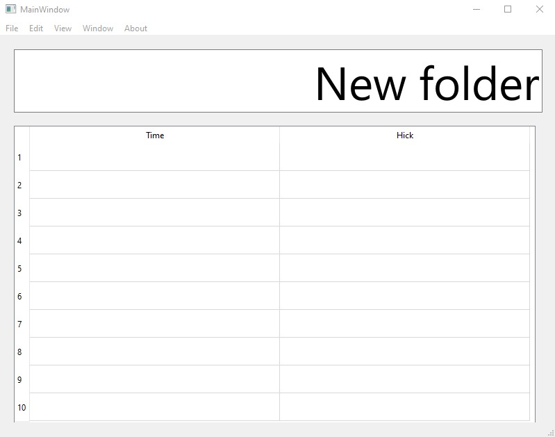

# Измерение времени реакции пользователя на события от выбора пункта меню. Использование метода Хика.
Первичное окно с таблицей для вывода результатов, стандартная панель с пунктами меню и текстовая область для вывода сообщения о выборе необходимого пункта меню.

Главное окно

# Инструкция
После появления сообщения нажать на соответствующий пункт или подпункт меню.

# Требования
Скачать и установить Qt Creator

# Клонирование репозитория
git clone https://github.com/nKadykov/interactive_systems_3
